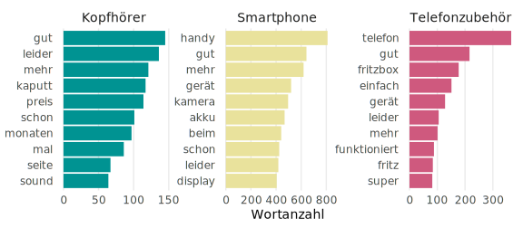
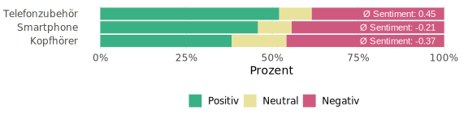
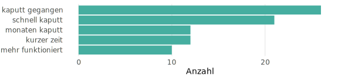
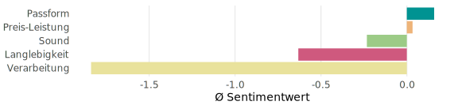

Kundenrezensionen bieten wertvolle Einblicke in die Nutzung und Bewertung von Produkten, oft jedoch in unstrukturierter Form. Mittels Methoden der Textanalyse lassen sich diese Informationen systematisch aufbereiten und helfen, Nutzerbedürfnisse gezielt zu erkennen. Ziel dieser Case Study ist es, ein differenziertes Bild der Kundenerfahrungen mit verschiedenen technischen Produktgruppen zu zeichnen und daraus Verbesserungspotenziale abzuleiten.

### Laden des Datensatzes

Die Analyse basiert auf 3.413 deutschsprachigen Amazon-Rezensionen, die jeweils das Datum, die Sternebewertung und den Link der Rezension enthalten. Ein Ausschnitt der ersten Beobachtungen ist in der folgenden Tabelle dargestellt.

<button data-glide-dir="&lt;" class="glide__btn-left btn text-primary">
<i class="fa-solid fa-angles-left"></i>
</button>

Beispielbeobachtungen aus dem Rohdatensatz

<button data-glide-dir="&gt;" class="glide__btn-right btn text-primary">
<i class="fa-solid fa-angles-right"></i>
</button>

<ul class="list-group list-group-flush">
<li class="list-group-item">

<code>Datum:</code>
13. Oktober 2016

</li>
<li class="list-group-item">

<code>Titel:</code>
Falsche Lieferung (eingeschränkte Version), Rücksendung dzt am Laufen. Produkt noch nicht getestet.

</li>
<li class="list-group-item">

<code>Rezension:</code>
In der Auswahl waren einige Galaxy S7 günstiger und mit "EUROPEAN SIM CARD ONLY" in der Produktbeschreibung gekennzeichnet. Das gekaufte S7 hatte (in der Beschreibung) diese Einschränkung nicht, was für mich wichtig ist, da ich oft in Canada &amp; USA unterwegs bin. Originalverpakt zurückgesand, ich erwarte Ersatz.Schlechte Bewertung bezieht sich daher auf den Lieferanten, nicht auf das S7 selbst.

</li>
<li class="list-group-item">

<code>Bewertung:</code>
<i class="fa-solid fa-star" role="presentation"></i>
<i class="fa-regular fa-star" role="presentation"></i>
<i class="fa-regular fa-star" role="presentation"></i>
<i class="fa-regular fa-star" role="presentation"></i>
<i class="fa-regular fa-star" role="presentation"></i>

</li>
<li class="list-group-item">

<code>URL:</code>
<a href="https://www.amazon.de/Samsung-Galaxy-Smartphone-interner-Speicher-Black/product-reviews/B01BTZFM0W/ref=cm_cr_arp_d_paging_btm_105?ie=UTF8&amp;pageNumber=105&amp;reviewerType=all_reviews">https://www.amazon.de/Samsung-Galaxy-Smartphone-interner-Speicher-Black/product-reviews/B01BTZFM0W/ref=cm_cr_arp_d_paging_btm_105?ie=UTF8&amp;pageNumber=105&amp;reviewerType=all_reviews</a>

</li>
</ul>

<ul class="list-group list-group-flush">
<li class="list-group-item">

<code>Datum:</code>
26. Februar 2017

</li>
<li class="list-group-item">

<code>Titel:</code>
Galaxy S7

</li>
<li class="list-group-item">

<code>Rezension:</code>
5.0 von 5 SternenBekanntes gutes smartphone

Konnte das Smartphone für unter 500 Euro ergattern und bin bislang sehr zufrieden,ich kann es weiterempfehlen.

</li>
<li class="list-group-item">

<code>Bewertung:</code>
<i class="fa-solid fa-star" role="presentation"></i>
<i class="fa-solid fa-star" role="presentation"></i>
<i class="fa-solid fa-star" role="presentation"></i>
<i class="fa-solid fa-star" role="presentation"></i>
<i class="fa-solid fa-star" role="presentation"></i>

</li>
<li class="list-group-item">

<code>URL:</code>
<a href="https://www.amazon.de/Samsung-Galaxy-Smartphone-interner-Speicher-Black/product-reviews/B01BTZFM0W/ref=cm_cr_arp_d_paging_btm_37?ie=UTF8&amp;pageNumber=37&amp;reviewerType=all_reviews">https://www.amazon.de/Samsung-Galaxy-Smartphone-interner-Speicher-Black/product-reviews/B01BTZFM0W/ref=cm_cr_arp_d_paging_btm_37?ie=UTF8&amp;pageNumber=37&amp;reviewerType=all_reviews</a>

</li>
</ul>

<ul class="list-group list-group-flush">
<li class="list-group-item">

<code>Datum:</code>
13. Oktober 2016

</li>
<li class="list-group-item">

<code>Titel:</code>
Anlaufschwierigkeiten

</li>
<li class="list-group-item">

<code>Rezension:</code>
Display blieb nach dem ersten Aufladen schwarz. Der empfohlene Restart hat nicht funktioniert. Geraet liess sich auch nicht abschalten. Akku war heissgelaufen. Samsung Reparaturservice hat Hardwarefehler festgestellt &amp; hat Platine ausgewechselt. Danach ging die Kamera nicht. Samsung hat deshalb auch die Kamera ausgewechselt. Zur Zeit funktioniert es. Sollte es so bleiben, ist es ein gutes Geraet.

</li>
<li class="list-group-item">

<code>Bewertung:</code>
<i class="fa-solid fa-star" role="presentation"></i>
<i class="fa-solid fa-star" role="presentation"></i>
<i class="fa-solid fa-star" role="presentation"></i>
<i class="fa-solid fa-star" role="presentation"></i>
<i class="fa-regular fa-star" role="presentation"></i>

</li>
<li class="list-group-item">

<code>URL:</code>
<a href="https://www.amazon.de/Samsung-Galaxy-Smartphone-interner-Speicher-Black/product-reviews/B01BTZFM0W/ref=cm_cr_arp_d_paging_btm_41?ie=UTF8&amp;pageNumber=41&amp;reviewerType=all_reviews">https://www.amazon.de/Samsung-Galaxy-Smartphone-interner-Speicher-Black/product-reviews/B01BTZFM0W/ref=cm_cr_arp_d_paging_btm_41?ie=UTF8&amp;pageNumber=41&amp;reviewerType=all_reviews</a>

</li>
</ul>

<ul class="list-group list-group-flush">
<li class="list-group-item">

<code>Datum:</code>
4. Februar 2020

</li>
<li class="list-group-item">

<code>Titel:</code>
für tägliche Nutzung ungeeignet

</li>
<li class="list-group-item">

<code>Rezension:</code>
nicht besonders, 2 mal gekauft und jeweils nach spätestens 6 Monaten defekt

</li>
<li class="list-group-item">

<code>Bewertung:</code>
<i class="fa-solid fa-star" role="presentation"></i>
<i class="fa-regular fa-star" role="presentation"></i>
<i class="fa-regular fa-star" role="presentation"></i>
<i class="fa-regular fa-star" role="presentation"></i>
<i class="fa-regular fa-star" role="presentation"></i>

</li>
<li class="list-group-item">

<code>URL:</code>
<a href="https://www.amazon.de/Gritin-Kopfh%C3%B6rer-Metallisches-Ohrst%C3%B6pseln-Smartphones/product-reviews/B07BWHHBST/ref=cm_cr_arp_d_paging_btm_39?ie=UTF8&amp;filterByStar=critical&amp;pageNumber=39&amp;reviewerType=all_reviews">https://www.amazon.de/Gritin-Kopfh%C3%B6rer-Metallisches-Ohrst%C3%B6pseln-Smartphones/product-reviews/B07BWHHBST/ref=cm_cr_arp_d_paging_btm_39?ie=UTF8&amp;filterByStar=critical&amp;pageNumber=39&amp;reviewerType=all_reviews</a>

</li>
</ul>

<ul class="list-group list-group-flush">
<li class="list-group-item">

<code>Datum:</code>
25. Oktober 2018

</li>
<li class="list-group-item">

<code>Titel:</code>
Unzufrieden

</li>
<li class="list-group-item">

<code>Rezension:</code>
Habe inzwischen drei von diesen T Shirts bestellt. In schwarz, lila und weiß. Alle drei haben schon nach dem ersten Kickboxtraining Fäden gezogen, was einfach das gesamte T Shirt hässlich aussehen ließ. Unter einem Pullover würde ich das T Shirt auch nicht anziehen, da durch die Reibung mit dem Innenfutter der meksten Pullover unschöne Stellen entstehen können.
Zwei sofort wieder zurückgeschickt, das dritte behalte ich jetzt einfach, weil ich keine Lust mehr auf das Hin und Herfahren zum Rücksenden habe.
Die Größe hingegegen war gut. L ist L. Ich bin 1,94 groß und wiege 68 KG, L war saß nicht zu knapp aber auch nicht zu eng.
Alles in allem bin ich sehr enttäuscht von Nike. Bin ein großer Nike Fan.
Würde für alle, die eine etwas aktivere Sportart machen Baumwoll T Shirts empfehlen. Habe mir die von Erima gekauft und bin vollstens zufrieden.

</li>
<li class="list-group-item">

<code>Bewertung:</code>
<i class="fa-solid fa-star" role="presentation"></i>
<i class="fa-regular fa-star" role="presentation"></i>
<i class="fa-regular fa-star" role="presentation"></i>
<i class="fa-regular fa-star" role="presentation"></i>
<i class="fa-regular fa-star" role="presentation"></i>

</li>
<li class="list-group-item">

<code>URL:</code>
<a href>NA</a>

</li>
</ul>

<ul class="list-group list-group-flush">
<li class="list-group-item">

<code>Datum:</code>
12. November 2016

</li>
<li class="list-group-item">

<code>Titel:</code>
Von iPhone 4 zu Samsung Galaxy S7

</li>
<li class="list-group-item">

<code>Rezension:</code>
Ich habe bislang ein iPhone 4 genutzt. Das wurde aber nach ca. 5 Jahren immer langsamer. Wollte ein Handy mit LTE und Power. Umstellung von iOS auf Android war nicht wirklich schwierig. Die Kamera und ihre Funktionen sind wirklich super. Nach ca. 1/2 Jahr Nutzung bin ich noch immer voll zufrieden und kann es jedem weiterempfehlen.

</li>
<li class="list-group-item">

<code>Bewertung:</code>
<i class="fa-solid fa-star" role="presentation"></i>
<i class="fa-solid fa-star" role="presentation"></i>
<i class="fa-solid fa-star" role="presentation"></i>
<i class="fa-solid fa-star" role="presentation"></i>
<i class="fa-solid fa-star" role="presentation"></i>

</li>
<li class="list-group-item">

<code>URL:</code>
<a href="https://www.amazon.de/Samsung-Galaxy-Smartphone-interner-Speicher-Black/product-reviews/B01BTZFM0W/ref=cm_cr_arp_d_paging_btm_87?ie=UTF8&amp;pageNumber=87&amp;reviewerType=all_reviews">https://www.amazon.de/Samsung-Galaxy-Smartphone-interner-Speicher-Black/product-reviews/B01BTZFM0W/ref=cm_cr_arp_d_paging_btm_87?ie=UTF8&amp;pageNumber=87&amp;reviewerType=all_reviews</a>

</li>
</ul>

<ul class="list-group list-group-flush">
<li class="list-group-item">

<code>Datum:</code>
20. November 2019

</li>
<li class="list-group-item">

<code>Titel:</code>
Sehr gutes Warehouse-Deal-Schnäppchen!

</li>
<li class="list-group-item">

<code>Rezension:</code>
Nachdem sich nach vielen Jahren eines unserer beiden Mobilteile "verabschiedet" hat (Stimme des Anrufenden plötzlich sehr leise trotz Lautstärke max.), musste was Neues her... Habe mich wieder für Gigaset entschieden und das Mobilteil sollte wieder
- ohne Basis - direkt an die Fritzbox angemeldet werden. Nach Lesen von Rezensionen und Testberichten habe ich dieses Modell sogar zweimal als Warehouse-Deal bestellt, das noch funktionierende Mobilteil wird als drittes weiter benutzt. Die gelieferten Geräte waren in einwandfreiem Zustand und ließen sich einfach anmelden und einrichten. Bei beiden Geräte hieß es als Warehouse-Deal "fehlendes Zubehör", aber nur bei einem Gerät fehlten die Akkus (AAA), welche ich vom alten Telefon weiter benutzt habe. Ein guter Kauf!

</li>
<li class="list-group-item">

<code>Bewertung:</code>
<i class="fa-solid fa-star" role="presentation"></i>
<i class="fa-solid fa-star" role="presentation"></i>
<i class="fa-solid fa-star" role="presentation"></i>
<i class="fa-solid fa-star" role="presentation"></i>
<i class="fa-solid fa-star" role="presentation"></i>

</li>
<li class="list-group-item">

<code>URL:</code>
<a href="https://www.amazon.de/Gigaset-C430HX-Universal-Mobilteil-Basisstationen-schwarz-silber-schwarz/product-reviews/B01BI8HG5Y/ref=cm_cr_arp_d_paging_btm_3?ie=UTF8&amp;pageNumber=3&amp;reviewerType=all_reviews">https://www.amazon.de/Gigaset-C430HX-Universal-Mobilteil-Basisstationen-schwarz-silber-schwarz/product-reviews/B01BI8HG5Y/ref=cm_cr_arp_d_paging_btm_3?ie=UTF8&amp;pageNumber=3&amp;reviewerType=all_reviews</a>

</li>
</ul>

<ul class="list-group list-group-flush">
<li class="list-group-item">

<code>Datum:</code>
9. Februar 2020

</li>
<li class="list-group-item">

<code>Titel:</code>
Naja

</li>
<li class="list-group-item">

<code>Rezension:</code>
Vom Klang her okay,
Aber nach 2 Monaten Kabelbruch.

</li>
<li class="list-group-item">

<code>Bewertung:</code>
<i class="fa-solid fa-star" role="presentation"></i>
<i class="fa-solid fa-star" role="presentation"></i>
<i class="fa-regular fa-star" role="presentation"></i>
<i class="fa-regular fa-star" role="presentation"></i>
<i class="fa-regular fa-star" role="presentation"></i>

</li>
<li class="list-group-item">

<code>URL:</code>
<a href="https://www.amazon.de/JBL-Ear-Kopfh%C3%B6rer-Steuerung-Mikrofon-schwarz/product-reviews/B01MG62Z5M/ref=cm_cr_arp_d_paging_btm_22?ie=UTF8&amp;filterByStar=critical&amp;pageNumber=22&amp;reviewerType=all_reviews">https://www.amazon.de/JBL-Ear-Kopfh%C3%B6rer-Steuerung-Mikrofon-schwarz/product-reviews/B01MG62Z5M/ref=cm_cr_arp_d_paging_btm_22?ie=UTF8&amp;filterByStar=critical&amp;pageNumber=22&amp;reviewerType=all_reviews</a>

</li>
</ul>

<ul class="list-group list-group-flush">
<li class="list-group-item">

<code>Datum:</code>
5. Dezember 2016

</li>
<li class="list-group-item">

<code>Titel:</code>
Keine 2 Monate in Betrieb und schon defekt....

</li>
<li class="list-group-item">

<code>Rezension:</code>
Seit Freitag den 03.12.2016 kaputt/ defekt... Mal sehen wie das mit dem Umtausch/Rückgabe läuft... Ist infach nervig, gerade vor Weihnachten

</li>
<li class="list-group-item">

<code>Bewertung:</code>
<i class="fa-solid fa-star" role="presentation"></i>
<i class="fa-regular fa-star" role="presentation"></i>
<i class="fa-regular fa-star" role="presentation"></i>
<i class="fa-regular fa-star" role="presentation"></i>
<i class="fa-regular fa-star" role="presentation"></i>

</li>
<li class="list-group-item">

<code>URL:</code>
<a href="https://www.amazon.de/Oral-B-600-CrossAction-Elektrische-Zahnb%C3%BCrste/product-reviews/B00KBWBPRY/ref=cm_cr_arp_d_paging_btm_20?ie=UTF8&amp;filterByStar=critical&amp;pageNumber=20&amp;reviewerType=all_reviews">https://www.amazon.de/Oral-B-600-CrossAction-Elektrische-Zahnb%C3%BCrste/product-reviews/B00KBWBPRY/ref=cm_cr_arp_d_paging_btm_20?ie=UTF8&amp;filterByStar=critical&amp;pageNumber=20&amp;reviewerType=all_reviews</a>

</li>
</ul>

<ul class="list-group list-group-flush">
<li class="list-group-item">

<code>Datum:</code>
4. März 2019

</li>
<li class="list-group-item">

<code>Titel:</code>
Not good

</li>
<li class="list-group-item">

<code>Rezension:</code>
I used only for 3 months and then it's broken. Really I didn't like this product. One of the bed point of this handsfree was it had connection problem with my phone.overall I will not recommend to buy this handsfree.

</li>
<li class="list-group-item">

<code>Bewertung:</code>
<i class="fa-solid fa-star" role="presentation"></i>
<i class="fa-regular fa-star" role="presentation"></i>
<i class="fa-regular fa-star" role="presentation"></i>
<i class="fa-regular fa-star" role="presentation"></i>
<i class="fa-regular fa-star" role="presentation"></i>

</li>
<li class="list-group-item">

<code>URL:</code>
<a href>NA</a>

</li>
</ul>

### Vorverarbeitung der Textdaten

In dieser Analyse kommen überwiegend **lexikon- und regelbasierte Verfahren** zum Einsatz, die empfindlich auf irrelevante Inhalte reagieren. Bevor sich jedoch das Signal erkennen lässt, muss das Rauschen entfernt werden.

Als erster Schritt wird der Text daher so aufbereitet, dass aus der Vielzahl an Formulierungen, Füllwörtern und inhaltsarmen Begriffen jene sprachlichen Elemente herausgefiltert werden, die einen **bedeutungsvollen Mehrwert** bieten. Dieser Prozess ist als  bekannt und bildet die Grundlage für konsistente und aussagekräftige Ergebnisse.

Die folgenden Schritte wurden dabei durchgeführt:


 **Bereinigung der Sternebewertungen:** Bewertungsangaben im Fließtext wurden extrahiert und als numerische Werte gespeichert (z.B. „5,0 von 5 Sternen" → 5). 
 **Tokenisierung:** Die Texte wurden in einzelne Wörter zerlegt, um eine strukturierte Analyse zu ermöglichen. 
 **Stopword-Filter:** Häufige, wenig aussagekräftige Wörter (z.B. „und", „ist", "oder") sowie produktspezifische Begriffe wurden entfernt. 


Diese Schritte gewährleisten, dass die nachfolgenden Analysen auf dem **wesentlichen Kern** der Kundenrezensionen basieren.

<button data-glide-dir="&lt;" class="glide__btn-left btn text-primary">
<i class="fa-solid fa-angles-left"></i>
</button>

Beispielbeobachtung nach der Vorverarbeitung

<button data-glide-dir="&gt;" class="glide__btn-right btn text-primary">
<i class="fa-solid fa-angles-right"></i>
</button>

<ul class="list-group list-group-flush">
<li class="list-group-item">

<code>Produkt:</code>
Gigaset C430HX Universal Mobilteil Basisstationen schwarz silber schwarz

</li>
<li class="list-group-item">

<code>Produkttyp:</code>
Telefonzubehör

</li>
<li class="list-group-item">

<code>Bewertung:</code>
5

</li>
<li class="list-group-item">

<code>Wörter:</code>
["genau", "suchte", "perfektes", "preis", "leistungsverhältnis"]

</li>
</ul>

<ul class="list-group list-group-flush">
<li class="list-group-item">

<code>Produkt:</code>
Samsung Galaxy Smartphone interner Speicher Black

</li>
<li class="list-group-item">

<code>Produkttyp:</code>
Smartphone

</li>
<li class="list-group-item">

<code>Bewertung:</code>
1

</li>
<li class="list-group-item">

<code>Wörter:</code>
["verkäufer", "wirbt", "produktinformation", "europäischer", "modellnummer", "sm", "g930fzkadbt", "geliefert", "nordamerikanischer", "g930u", "funktioniert", "europa", "vollem", "umfang", "z.b", "sim", "karte", "unterschiedlich", "originale", "label", "wurde", "überklebt", "u", "steht", "land", "handy", "hergestellt", "g930f", "europäischen", "martk", "bestimmter", "variante", "noramerika", "markt", "telefon", "grundsätzlich", "gleichen", "leistungsmerkmale", "jedoch", "verbindung", "deutschen", "probleme", "bereiten", "bzw", "netzabhängigen", "nutzbar", "h", "gerritsen"]

</li>
</ul>

<ul class="list-group list-group-flush">
<li class="list-group-item">

<code>Produkt:</code>
Gritin Kopfhörer Metallisches Ohrstöpseln Smartphones

</li>
<li class="list-group-item">

<code>Produkttyp:</code>
Smartphone

</li>
<li class="list-group-item">

<code>Bewertung:</code>
1

</li>
<li class="list-group-item">

<code>Wörter:</code>
["preis", "ganz", "solide", "sowohl", "qualität", "klang", "her", "problem", "nacht", "mal", "monaten", "funktioniert", "buds", "mehr", "trotz", "pfleglichem", "gebrauch", "daher", "eigentlich", "kaum", "gebrauchen"]

</li>
</ul>

<ul class="list-group list-group-flush">
<li class="list-group-item">

<code>Produkt:</code>
Gigaset Schnurloses Anrufbeantworter Freisprechfunktion Bedienung schwarz

</li>
<li class="list-group-item">

<code>Produkttyp:</code>
Telefonzubehör

</li>
<li class="list-group-item">

<code>Bewertung:</code>
2

</li>
<li class="list-group-item">

<code>Wörter:</code>
["qualität", "mehr", "versprochen", "ton", "auswahl", "melodien", "befriedigend"]

</li>
</ul>

<ul class="list-group list-group-flush">
<li class="list-group-item">

<code>Produkt:</code>
Gigaset C430HX Universal Mobilteil Basisstationen schwarz silber schwarz

</li>
<li class="list-group-item">

<code>Produkttyp:</code>
Telefonzubehör

</li>
<li class="list-group-item">

<code>Bewertung:</code>
5

</li>
<li class="list-group-item">

<code>Wörter:</code>
["telefon", "knopfdruck", "router", "angemeldet", "ansonsten", "einfach", "bedienen"]

</li>
</ul>

<ul class="list-group list-group-flush">
<li class="list-group-item">

<code>Produkt:</code>
AVM DECT Komforttelefon Komfortdienste Box Funktionen deutschsprachige Schwarz

</li>
<li class="list-group-item">

<code>Produkttyp:</code>
Telefonzubehör

</li>
<li class="list-group-item">

<code>Bewertung:</code>
3

</li>
<li class="list-group-item">

<code>Wörter:</code>
["benötige", "telefon", "demnächsat", "hause", "arbeiten", "wahl", "verschiedenen", "gründen", "fritz", "fon", "c5", "u", "a", "optisch", "wirklich", "besser", "ausschaut", "sont", "üblichen", "gigasets", "lieferung", "kam", "schnell", "ausgepackt", "angeschlossen", "positiv", "optik", "anschluss", "einfach", "funktioniert", "bzw", "obwohl", "fritzbox", "weit", "garage", "hängt", "internetradio", "eigentlich", "spässchen", "klang", "her", "geht", "gut", "negativ", "hinten", "billiges", "plastik", "leider", "überall", "vorne", "schöne", "oberfläche", "sofort", "fingerabdrücken", "verziert", "immer", "brillenputztuch", "daneben", "legen", "annäherungssensor", "wohl", "vorhanden", "egal", "tut", "ändert", "tastaturbeleuchtung", "doll", "regel", "sekunde", "länger", "mal", "sekunden", "unterschiedlich", "je", "gerät", "hält", "möchte", "funktion", "nutzen", "hell", "büro", "nervt", "zusammenspiel", "näherungssensor", "ja", "irgendwie", "schon", "doof", "stationären", "telefonen", "eindeutig", "gelöst", "rigide", "geregelt", "funken", "licht", "bleibt", "dunkel", "greift", "wenig", "früh", "energiesparmodus", "abhilfe", "beim", "wählen", "finger", "lichtsensor"]

</li>
</ul>

<ul class="list-group list-group-flush">
<li class="list-group-item">

<code>Produkt:</code>
Samsung Galaxy Smartphone interner Speicher Black

</li>
<li class="list-group-item">

<code>Produkttyp:</code>
Smartphone

</li>
<li class="list-group-item">

<code>Bewertung:</code>
5

</li>
<li class="list-group-item">

<code>Wörter:</code>
["tja", "sagen", "eigentlich", "außer", "weltklasse", "läuft", "flüssig", "verbauten", "sachen", "verwunderlich", "liegt", "super", "hand", "vorher", "vertrag", "ausgelaufen", "somit", "übersprungen", "vielleicht", "deswegen", "extrem", "begeistert", "tolle", "gerät", "schmälern", "wirklich", "klasse", "jemand", "schon", "schrieb", "zwingend", "notwendig", "holen", "denke", "mal", "unterschied", "sooooo", "riesig", "na", "ja", "lange", "rede", "kurzer", "sinn", "fälle", "empfehlen", "top", "teil", "akku", "leider", "echt", "froh", "gleich", "geholt", "erst", "angedacht", "xperia", "z5"]

</li>
</ul>

<ul class="list-group list-group-flush">
<li class="list-group-item">

<code>Produkt:</code>
Samsung Galaxy Smartphone interner Speicher Black

</li>
<li class="list-group-item">

<code>Produkttyp:</code>
Smartphone

</li>
<li class="list-group-item">

<code>Bewertung:</code>
4

</li>
<li class="list-group-item">

<code>Wörter:</code>
["etwa", "jahr", "gebrauch", "praktisch", "nie", "stich", "gelassen", "verwende", "insbesondere", "arbeiten", "sodass", "rezension", "hiernach", "richten", "möchte", "verarbeitung", "design", "mag", "mittlerweile", "veraltetes", "aufweisen", "zumal", "nahezu", "randlosen", "allerdings", "lässt", "kaum", "wünsche", "übrig", "spaltmaße", "stimmig", "aluminiumgehäuse", "macht", "dennoch", "her", "sicherlich", "größere", "ränder", "führen", "besseren", "bedienbarkeit", "hierdurch", "fehleingaben", "minimiert", "insofern", "bleibt", "relativ", "schickes", "physischen", "homebutton", "vielen", "kunden", "immer", "gefallen", "funktionsumfang", "bereits", "geraumer", "zeit", "android", "oreo", "update", "ausgerollt", "gerät", "läuft", "mehr", "weniger", "butterweich", "ansonsten", "werkelt", "samsungs", "eigene", "benutzeroberfläche", "jahren", "hübscher", "geworden", "intuitiv", "bedienen", "bietet", "ehemaligen", "flagschiff", "recht", "großen", "display", "hervorragender", "schärfe", "guter", "helligkeit", "zügigen", "exynos", "prozessor", "drahtloses", "laden", "uvm", "misse", "eigentlich", "fehlende", "gesichtsentsperrung", "integrierten", "fingerabdrucksensor", "wettgemacht", "passt", "preisdiskussion", "offensichtlich", "preis", "stark", "wäre", "euro", "völlig", "solides", "arbeitsgerät", "sehe", "funktionstechnisch", "unterschiede", "neueren", "geräten", "mal", "abgesehen", "wenig", "neues", "bieten", "dank", "aufmerksamkeit"]

</li>
</ul>

<ul class="list-group list-group-flush">
<li class="list-group-item">

<code>Produkt:</code>
Gigaset C430HX Universal Mobilteil Basisstationen schwarz silber schwarz

</li>
<li class="list-group-item">

<code>Produkttyp:</code>
Telefonzubehör

</li>
<li class="list-group-item">

<code>Bewertung:</code>
5

</li>
<li class="list-group-item">

<code>Wörter:</code>
["altes", "hagenuk", "telefon", "ersetzt", "gute", "verarbeitung", "lange", "standzeit", "sprachqualität", "hochfrequent", "gut", "verständlich", "jederzeit", "kaufen"]

</li>
</ul>

<ul class="list-group list-group-flush">
<li class="list-group-item">

<code>Produkt:</code>
Gigaset C430HX Universal Mobilteil Basisstationen schwarz silber schwarz

</li>
<li class="list-group-item">

<code>Produkttyp:</code>
Telefonzubehör

</li>
<li class="list-group-item">

<code>Bewertung:</code>
5

</li>
<li class="list-group-item">

<code>Wörter:</code>
["gestern", "schöne", "telefon", "angekommen", "akkus", "hand", "teil", "eingelegt", "station", "steckdose", "router", "anmelden", "gedrückt", "schon", "konnte", "telefonieren", "minuten", "gedauert", "richten", "völlig", "problemlos", "selbsterklärend", "sogar", "hd", "gesprächsqualität", "super", "sache", "allerdings", "normalen", "genommen", "mah", "amazon", "bestellt", "einfach", "mehr", "leistung", "halten", "länger", "standby", "zeit", "erhöht", "dadurch", "merklich"]

</li>
</ul>

### Analyse

#### Erste Einblicke: Vergleich der Produktkategorien

Wir beginnen mit einer rein **explorativen Betrachtung:** Gibt es Unterschiede in der durchschnittlichen Bewertung zwischen den Produktkategorien?

Dazu werden die Produktnamen aus den URLs extrahiert und manuell drei Kategorien zugeordnet: **Smartphones**, **Kopfhörer** und **Telefonzubehör.**

**Beispiel:** Aus der URL *https://www.amazon.de/sony-kopfhoerer-mdr/product-reviews/* wird „sony kopfhoerer mdr" extrahiert und der Kategorie „Kopfhörer" zugewiesen.

<?xml version="1.0" encoding="UTF-8"?>

  <table class="gt_table" data-quarto-disable-processing="true" data-quarto-bootstrap="false" style="-webkit-font-smoothing: antialiased; -moz-osx-font-smoothing: grayscale; font-family: var(--bs-body-font-family); display: table; border-collapse: collapse; line-height: normal; margin-left: auto; margin-right: auto; color: #333333; font-size: var(--bs-body-font-size); font-weight: var(--bs-body-fontweight); font-style: normal; background-color: rgba(255, 255, 255, 0); width: 100%; border-top-style: solid; border-top-width: 2px; border-top-color: #A8A8A8; border-right-style: none; border-right-width: 2px; border-right-color: #D3D3D3; border-bottom-style: solid; border-bottom-width: 2px; border-bottom-color: #A8A8A8; border-left-style: none; border-left-width: 2px; border-left-color: #D3D3D3;" width="100%" bgcolor="rgba(255, 255, 255, 0)">
    <thead style="border-style: none;">
      <tr class="gt_col_headings" style="border-style: none; border-top-style: solid; border-top-width: 2px; border-top-color: #D3D3D3; border-bottom-style: solid; border-bottom-width: 2px; border-bottom-color: #D3D3D3; border-left-style: none; border-left-width: 1px; border-left-color: #D3D3D3; border-right-style: none; border-right-width: 1px; border-right-color: #D3D3D3;">
        <th class="gt_col_heading gt_columns_bottom_border gt_left" rowspan="1" colspan="1" scope="col" id="Produkttyp" style="border-style: none; color: #333333; background-color: rgba(255, 255, 255, 0); font-size: 100%; font-weight: bold; text-transform: inherit; border-left-style: none; border-left-width: 1px; border-left-color: #D3D3D3; border-right-style: none; border-right-width: 1px; border-right-color: #D3D3D3; vertical-align: bottom; padding-top: 5px; padding-bottom: 6px; padding-left: 5px; padding-right: 5px; overflow-x: hidden; text-align: left;" bgcolor="rgba(255, 255, 255, 0)" valign="bottom" align="left">Produkttyp</th>
        <th class="gt_col_heading gt_columns_bottom_border gt_right" rowspan="1" colspan="1" scope="col" id="avg_rating" style="border-style: none; color: #333333; background-color: rgba(255, 255, 255, 0); font-size: 100%; font-weight: bold; text-transform: inherit; border-left-style: none; border-left-width: 1px; border-left-color: #D3D3D3; border-right-style: none; border-right-width: 1px; border-right-color: #D3D3D3; vertical-align: bottom; padding-top: 5px; padding-bottom: 6px; padding-left: 5px; padding-right: 5px; overflow-x: hidden; text-align: right; font-variant-numeric: tabular-nums;" bgcolor="rgba(255, 255, 255, 0)" valign="bottom" align="right">Ø Bewertung</th>
      </tr>
    </thead>
    <tbody class="gt_table_body" style="border-style: none; border-top-style: solid; border-top-width: 2px; border-top-color: #D3D3D3; border-bottom-style: solid; border-bottom-width: 2px; border-bottom-color: #D3D3D3;">
      <tr style="border-style: none;">
        <td headers="Produkttyp" class="gt_row gt_left" style="border-style: none; padding-top: 8px; padding-bottom: 8px; padding-left: 5px; padding-right: 5px; margin: 10px; border-top-style: solid; border-top-width: 1px; border-top-color: #D3D3D3; border-left-style: none; border-left-width: 1px; border-left-color: #D3D3D3; border-right-style: none; border-right-width: 1px; border-right-color: #D3D3D3; vertical-align: middle; overflow-x: hidden; text-align: left;" valign="middle" align="left">Telefonzubehör</td>
        <td headers="avg_rating" class="gt_row gt_right" style="border-style: none; padding-top: 8px; padding-bottom: 8px; padding-left: 5px; padding-right: 5px; margin: 10px; border-top-style: solid; border-top-width: 1px; border-top-color: #D3D3D3; border-left-style: none; border-left-width: 1px; border-left-color: #D3D3D3; border-right-style: none; border-right-width: 1px; border-right-color: #D3D3D3; vertical-align: middle; overflow-x: hidden; text-align: right; font-variant-numeric: tabular-nums;" valign="middle" align="right">3.62</td>
      </tr>
      <tr style="border-style: none;">
        <td headers="Produkttyp" class="gt_row gt_left" style="border-style: none; padding-top: 8px; padding-bottom: 8px; padding-left: 5px; padding-right: 5px; margin: 10px; border-top-style: solid; border-top-width: 1px; border-top-color: #D3D3D3; border-left-style: none; border-left-width: 1px; border-left-color: #D3D3D3; border-right-style: none; border-right-width: 1px; border-right-color: #D3D3D3; vertical-align: middle; overflow-x: hidden; text-align: left;" valign="middle" align="left">Smartphone</td>
        <td headers="avg_rating" class="gt_row gt_right" style="border-style: none; padding-top: 8px; padding-bottom: 8px; padding-left: 5px; padding-right: 5px; margin: 10px; border-top-style: solid; border-top-width: 1px; border-top-color: #D3D3D3; border-left-style: none; border-left-width: 1px; border-left-color: #D3D3D3; border-right-style: none; border-right-width: 1px; border-right-color: #D3D3D3; vertical-align: middle; overflow-x: hidden; text-align: right; font-variant-numeric: tabular-nums;" valign="middle" align="right">3.09</td>
      </tr>
      <tr style="border-style: none;">
        <td headers="Produkttyp" class="gt_row gt_left" style="border-style: none; padding-top: 8px; padding-bottom: 8px; padding-left: 5px; padding-right: 5px; margin: 10px; border-top-style: solid; border-top-width: 1px; border-top-color: #D3D3D3; border-left-style: none; border-left-width: 1px; border-left-color: #D3D3D3; border-right-style: none; border-right-width: 1px; border-right-color: #D3D3D3; vertical-align: middle; overflow-x: hidden; text-align: left;" valign="middle" align="left">Kopfhörer</td>
        <td headers="avg_rating" class="gt_row gt_right" style="border-style: none; padding-top: 8px; padding-bottom: 8px; padding-left: 5px; padding-right: 5px; margin: 10px; border-top-style: solid; border-top-width: 1px; border-top-color: #D3D3D3; border-left-style: none; border-left-width: 1px; border-left-color: #D3D3D3; border-right-style: none; border-right-width: 1px; border-right-color: #D3D3D3; vertical-align: middle; overflow-x: hidden; text-align: right; font-variant-numeric: tabular-nums;" valign="middle" align="right">1.87</td>
      </tr>
    </tbody>
  </table>

Ein Blick auf den Durchschnitt der Bewertungen nach Produktkategorie zeigt zusätzlich Unterschiede in der Kundenzufriedenheit:


 Die Kategorie "Telefonzubehör" (z.B. Anrufbeantworter) schneidet im Schnitt am besten ab. 
 Kopfhörer hingegen zeigen im Vergleich die niedrigsten Durchschnittsbewertungen. 


#### Worthäufigkeiten

Um ein erstes Gefühl für den Inhalt der Kundenrezensionen zu erhalten, bietet sich eine einfache **Häufigkeitsanalyse** der verwendeten Begriffe an. Die erste Grafik zeigt die häufigsten Wörter über alle Produktkategorien hinweg. Begriffe wie "super", "funktioniert" und "zufrieden" lassen bereits darauf schließen, dass Kund:innen grundsätzlich positive Erfahrungen mit den Produkten machen. Sie liefern jedoch wenig tiefergehende Erkenntnisse, da sie sehr allgemein sind.

Im nächsten Schritt untersuchen wir die **häufigsten Begriffe pro Kategorie**, um inhaltliche Unterschiede sichtbar zu machen.

Während bei *Smartphones* und *Telefonzubehör* Begriffe wie „funktioniert" oder „super" dominieren, tauchen bei *Kopfhörern* vermehrt Wörter wie „kaputt" oder „wackelkontakt" auf. In Kombination mit der vergleichsweise niedrigen Durchschnittsbewertung deutet dies darauf hin, dass gerade bei Kopfhörern häufiger Probleme auftreten.

Häufigkeitsanalysen zeigen dominante Begriffe, vernachlässigen jedoch deren Aussagekraft pro Kategorie. Die TF-IDF-Analyse hebt hingegen kategorietypische Begriffe hervor. Die  gewichtet Wörter nicht nur nach ihrer Häufigkeit, sondern berücksichtigt auch, wie exklusiv sie für eine bestimmte Kategorie sind.

In der Grafik wird deutlich:


 Bei *Kopfhörern* stehen „musik", „kabelbruch" und „enttäuschend" für typische Nutzung und Schwächen. 

 Bei *Smartphones* dominieren Themen wie „kamera", „videos" und „wasserdicht". 

 Die Kategorie *Telefonzubehör* ist geprägt von Begriffen wie „fritzbox", „router" und „reichweite".


Dadurch lassen sich erste Hinweise auf die zentralen Themen und Probleme pro Produktkategorie identifizieren. Dies stellt einen wichtiger Schritt dar, um die Inhalte der Rezensionen gezielter auszuwerten und in späteren Analysen (z.B. Sentiment oder Themenmodellierung) weiter zu untersuchen.

#### Sentimentanalyse

Um über reine Sternebewertungen hinauszugehen, analysieren wir den Textinhalt der Rezensionen mithilfe einer . Dabei wird jeder Rezension einen numerischen Sentimentwert zugewiesen, der positive und negative Begriffe entsprechend abbildet.

Um die Stimmung in den Rezensionen je Produktkategorie besser einordnen zu können, wurden die Anteile positiver, negativer und neutraler Bewertungen berechnet und in einem Vergleichsdiagramm nach Produktgruppen visualisiert.

Die Kategorie *Telefonzubehör* sticht positiv hervor: Sie weist nicht nur den höchsten durchschnittlichen Sentimentwert auf (+0.45), sondern auch den größten Anteil an positiv formulierten Rezensionen (52%).

*Kopfhörer* hingegen erreichen den niedrigsten Sentimentwert (-0.37) und haben zugleich den geringsten Anteil an positiven Kommentaren (38%). Diese Ergebnisse decken sich mit den bisherigen Beobachtungen.

Über den Zeitverlauf hinweg zeigen die quartalsweisen Durchschnittswerte des Sentiments in den frühen Jahren teils starke Schwankungen, besonders bei *Kopfhörern* und *Telefonzubehör.* Ab etwa 2018 pendeln sich die Werte aller Produktkategorien nahe der neutralen Linie ein, mit leichten positiven Ausschlägen in den letzten Quartalen. Diese Entwicklung deutet auf eine zunehmende Stabilität in der Kundenwahrnehmung hin und ermöglicht es, potenzielle Stimmungseinbrüche frühzeitig zu erkennen und gezielt gegenzusteuern.

Während diese Gesamtentwicklung ein nützliches Stimmungsbarometer darstellt, bleibt jedoch unklar, welche konkreten Produktaspekte zu positiven oder negativen Bewertungen führen. Hier setzt die **aspektbasierte Sentimentanalyse (ABSA)**. Anstatt nur das Gesamtsentiment zu messen, wird jede Rezension auf **inhaltliche Schwerpunkte** wie Preis, Funktionalität, Qualität oder Service untersucht. So lässt sich nachvollziehen, ob ein Produkt trotz positiver Gesamtbewertung z. B. wegen mangelhafter Qualität kritisiert wird oder ob ein guter Service die Stimmung hebt.

Die durchschnittlichen Sentimentwerte je Aspekt zeigen deutliche Unterschiede zwischen den Produktkategorien. Während **Preis** in allen Kategorien überwiegend positiv bewertet wird, schneidet **Qualität** insbesondere bei *Kopfhörern* negativ ab. **Funktionalität** wird insgesamt neutral bis leicht negativ wahrgenommen, wohingegen der Aspekt **Service** vor allem bei *Telefonzubehör* besonders positiv bewertet wird. Diese Auswertung verdeutlicht, welche **Stärken und Schwächen aus Kundensicht je Kategorie** vorliegen.

Die Sentimentanalysen zeigen, dass insbesondere in der Kategorie *Kopfhörer* eine hohe Unzufriedenheit besteht.
Um die Ursachen dieser negativen Bewertungen besser zu verstehen, wird im Folgenden die Analyse gezielt auf diese Produktkategorie fokussiert. Ziel ist, herauszufinden, welche konkreten Probleme Kund:innen in Verbindung mit Kopfhörern am häufigsten nennen.

#### Analyse der Bigramme

Da die Sentimentanalyse bei Kopfhörern stark negativ ausfiel, lohnt es sich einen genaueren Blick auf wiederkehrende **Wortpaare** (Bigramme) zu werfen. Bigramme zeigen, welche Begriffe in den Rezensionen besonders häufig direkt aufeinander folgen und damit inhaltlich zusammengehören. So lassen sich typische Formulierungen und wiederkehrende Sprachmuster identifizieren, die bei der Analyse einzelner Wörter verborgen bleiben.

Eine Untersuchung der am häufigsten vorkommenden Bigramme in den Rezensionen für *Kopfhörer* offenbart ein zentrales Problem:

Wortpaare wie „kaputt gegangen", „monaten kaputt", oder „kurzer zeit" zeigen, dass viele Bewertungen auf schnelle Defekte und kurze Lebensdauer hinweisen. Kund:innen berichten von frühzeitigen Ausfällen, oft bereits nach wenigen Wochen oder Monaten.

Welche konkreten Themen die Konsumenten bezüglich der Produktkategorie *Kopfhörer* beschäftigt, wird im nächsten Schritt mithilfe einer Themenmodellierung betrachtet.

#### Themenmodellierung

Um die zentralen Kritikpunkte in den Rezensionen zur Produktkategorie *Kopfhörer* präziser herauszuarbeiten, berechnen wir im nächsten Schritt ein **Structural Topic Modelling (STM)**. Diese Methode bietet die Möglichkeit andere Faktoren, die die Themen beeinflussen könnten, zu berücksichtigen, wie die Bewertungen der Kund:innen und das Datum, an dem die Rezension verfasst wurde. Für unser Korpus ergeben sich fünf Schwerpunkte: Langlebigkeit, Verarbeitung, Passform, Sound und Preis-Leistung.

Die folgende Grafik zeigt für jedes Thema die repräsentativsten Begriffe. So wird deutlich, warum wir die Themen so benannt haben (z.B. „monaten", „wochen" oder "lebensdauer" im Thema *Langlebigkeit*).

Direkt anschließend betrachten wir, wie häufig diese Themen im Gesamtkorpus auftreten. Die Balkenhöhen geben die durchschnittliche Dokument‑Wahrscheinlichkeit je Thema an, was dem durchschnittlichen Anteil entspricht, den ein Thema an einer Rezension hat. Dadurch sehen wir nicht nur Beispiele, sondern die gewichtete Verteilung der Themen über alle Rezensionen hinweg.

Die Themen treten insgesamt relativ ausgeglichen auf, mit leicht höheren Anteilen für *Langlebigkeit* und *Preis-Leistung*, gefolgt von *Sound*, *Verarbeitung* und *Passform.*

Nachdem wir die Häufigkeit der Themen im Gesamtkorpus betrachtet haben, wenden wir uns nun der Frage zu, wie positiv oder negativ diese jeweils bewertet werden. Die Analyse der Sentimentwerte pro Thema zeigt: Am stärksten negativ wird die *Verarbeitung* bewertet. Auch beim *Sound* äußern Kunden deutliche Kritik, vermutlich aufgrund auftretender Probleme bei hohen Tönen, wie aus der Worthäufigkeitsanalyse der Themen hervorgeht. Die Themen *Preis-Leistung*, *Passform* und *Langlebigkeit* schneiden im Vergleich etwas besser ab, weisen jedoch ebenfalls einen negativen Grundton auf.

Die zeitliche Entwicklung der Themenanteile zeigt deutliche Verschiebungen in den Rezensionen: 2017 dominierten noch *Passform* und *Verarbeitung*, die in den ersten Monaten besonders häufig genannt wurden. Im Zeitverlauf rückten dagegen *Sound*, *Preis‑Leistung* und *Langlebigkeit* in den Vordergrund und lösten die zuvor dominierenden Themen ab. Das deutet darauf hin, dass sich die Kundenerwartungen von der anfänglichen Produktanpassung hin zu langfristiger Qualität zu einem fairen Preis verlagert haben. Positiv anzumerken ist, dass damit das Thema mit der negativsten Stimmung deutlich zurückgegangen ist.

### Fazit

In dieser Fallstudie haben wir gezeigt, welches Potenzial in der **systematischen Auswertung von Kundenrezensionen** steckt. Der freie Text in Rezensionen liefert wertvolle Informationen, ohne dass zusätzliche Befragungen oder aufwändige Erhebungen notwendig sind, wodurch **Ressourcen gespart** und anders eingesetzt werden können. Mithilfe geeigneter Analysemethoden lassen sich daraus konkrete Hinweise auf Produktqualität, Nutzererwartungen und mögliche Verbesserungspotenziale ableiten. Darüber hinaus kann die Analyse als **Echtzeit-Stimmungsbarometer** dienen. Unternehmen können frühzeitig erkennen, wenn sich negative Trends abzeichnen, und zeitnah reagieren, etwa durch Qualitätsverbesserungen, gezielte Kundenkommunikation oder Anpassung des Serviceangebots. So lassen sich Schwachstellen schneller beheben und die Produkte noch konsequenter an den Bedürfnissen der Kund:innen ausrichten.
