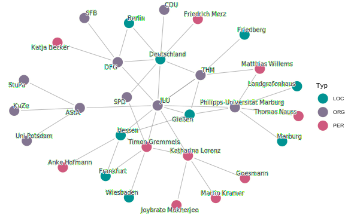

<!-- ## 🎯 Motivation der Fallstudie -->

## Motivation der Fallstudie

Unternehmen, Organisationen, Personen und mit ihnen verbundende Orte stehen heute in einem **dichten Geflecht öffentlicher Kommunikation**. Täglich erscheinen Hunderte von Nachrichtenartikel, die über sie berichten und sie in Zusammenhang mit verschiedenen Akteuren nennen.

Für kleine und mittlere Unternehmen (KMUs) wie auch für andere Organisationen wie z.B. der Hochschule "Justus-Liebig-Universität Gießen" gilt:


 Die eigene Sichtbarkeit in den Medien ist wichtig, um **Kunden, Partner und Förderer** zu erreichen.
 Gleichzeitig ist es entscheidend zu verstehen, **mit wem** man in den Nachrichten in Verbindung gebracht wird.


Hierfür eignet sich die Anwendung einer Netzwerkanalyse!

## Warum Netzwerkanalyse?

Eine **Netzwerkanalyse** hilft dabei, genau dieses Beziehungsgeflecht sichtbar zu machen:

 **Knoten** sind die **Entitäten** -- also Personen (PER), Organisationen (ORG) und Orte (LOC), die in Nachrichten erwähnt werden.
sichtbar.
 **Kanten** entstehen, wenn zwei Entitäten **gemeinsam in einem Artikel** auftauchen. 
 Aus vielen einzelnen Artikeln entsteht so ein **Netzwerk**, das zeigt, wer mit wem in Verbindung gebracht wird und welche Akteure besonders zentral sind. 


## Vorteile einer Netzwerkanalyse

Eine Netzwerkanalyse bietet eine Reihe von Vorteilen:


 **Durchblick gewinnen:** eine Netzwerkanalyse verdichtet viele Einzelinformationen und macht **Zusammenhänge und Beziehungen** sichtbar. 
 **Wichtige Akteure erkennen:** man sieht sofort, **welche Personen, Organisationen und Orte im Mittelpunkt stehen** und welche Verbindungen besonders stark sind. 
 **Einfach verständlich darstellen:** komplexe Beziehungen werden in **anschaulichen Grafiken** sichtbar und leicht kommunizierbar. 


## Anwendungsbeispiel

Am Beispiel der ORG-Entität **"Justus-Liebig-Universität"** wird ein exemplarisches Netzwerk aufgebaut. Grundlage sind **100 aktuelle Nachrichtenartikel**, die über die Justus-Liebig-Universität in **lokaler und überregionaler Berichterstattung** erschienen sind und im Google-News-Feed gelistet wurden. Diese Artikel werden automatisiert extrahiert und mithilfe eines **Eigennamenerkennungsmodells** analysiert. Das Modell identifiziert in den Texten **Personennamen (PER)**, **Ortsnamen (LOC)** und **Organisationsnamen (ORG)**. Auf dieser Basis lassen sich zentrale Akteure bestimmen und ihre Beziehungen sichtbar machen.

Das folgende Beispiel zeigt einen Ausschnitt aus einem Nachrichtenartikel, in dem die relevanten Entitäten farblich hervorgehoben sind:

> **Beispielausschnitt eines Nachrichtenartikels mit hervogehobenen Entitäten**
>
> 
> 
>
> \[...\] Die beiden traditionsreichsten Universitäten in <mark class="loc">Hessen (LOC)</mark> gehen gemeinsam in den Wettbewerb um den begehrten Titel »Exzellenzuniversität«. Die <mark class="org">Justus-Liebig-Universität Gießen (ORG)</mark> (<mark class="org">JLU (ORG)</mark>) und die <mark class="org">Philipps-Universität Marburg (ORG)</mark> (<mark class="org">UMR (ORG)</mark>) haben eine Absichtserklärung für einen Verbundantrag in der zweiten Förderlinie der Exzellenzstrategie eingereicht.
>
> Nach dem großen Erfolg der beiden Universitäten, die im Mai insgesamt vier Exzellenzcluster eingeworben haben, steht nun der nächste Schritt im bundesweiten Spitzenforschungswettbewerb an.
>
> »Dass wir nach unserem hervorragenden Abschneiden in der ersten Förderlinie unsere Kompetenzen bündeln und uns gemeinsam positionieren, ist die richtige Entscheidung«, sagt Prof. Dr. <mark class="per">Katharina Lorenz (PER)</mark>, Präsidentin der <mark class="org">Justus-Liebig-Universität (ORG)</mark>.
>
> »Wir blicken auf eine lange gemeinsame Geschichte zurück, die insbesondere in den letzten Jahrzehnten von einem sehr partnerschaftlichen Geist getragen ist.«(...)

In diesem Beispiel werden der Ort **„Hessen"**, die Person **„Katharina Lorenz"** sowie die Organisationen **„UMR"** und **„JLU"** als Entitäten erkannt. Wendet man dieses Verfahren systematisch auf alle JLU-bezogenen Nachrichtenartikel an, lassen sich die identifizierten Entitäten in einer **Häufigkeitstabelle** zusammenfassen. Auf diese Weise treten die wichtigsten Akteure deutlicher hervor.

Die folgende Tabelle zeigt die Häufigkeiten ausgewählter Entitäten:

<?xml version="1.0" encoding="UTF-8"?>

  <table class="gt_table" data-quarto-disable-processing="true" data-quarto-bootstrap="false" style="-webkit-font-smoothing: antialiased; -moz-osx-font-smoothing: grayscale; font-family: var(--bs-body-font-family); display: table; border-collapse: collapse; line-height: normal; margin-left: auto; margin-right: auto; color: #333333; font-size: var(--bs-body-font-size); font-weight: var(--bs-body-fontweight); font-style: normal; background-color: rgba(255, 255, 255, 0); width: 100%; border-top-style: solid; border-top-width: 2px; border-top-color: #A8A8A8; border-right-style: none; border-right-width: 2px; border-right-color: #D3D3D3; border-bottom-style: solid; border-bottom-width: 2px; border-bottom-color: #A8A8A8; border-left-style: none; border-left-width: 2px; border-left-color: #D3D3D3;" width="100%" bgcolor="rgba(255, 255, 255, 0)">
    <caption>Häufigkeiten ausgewählter Entitäten</caption>
    <thead style="border-style: none;">
      <tr class="gt_col_headings" style="border-style: none; border-top-style: solid; border-top-width: 2px; border-top-color: #D3D3D3; border-bottom-style: solid; border-bottom-width: 2px; border-bottom-color: #D3D3D3; border-left-style: none; border-left-width: 1px; border-left-color: #D3D3D3; border-right-style: none; border-right-width: 1px; border-right-color: #D3D3D3;">
        <th class="gt_col_heading gt_columns_bottom_border gt_right" rowspan="1" colspan="1" scope="col" id="Rang" style="border-style: none; color: #333333; background-color: rgba(255, 255, 255, 0); font-size: 100%; font-weight: bold; text-transform: inherit; border-left-style: none; border-left-width: 1px; border-left-color: #D3D3D3; border-right-style: none; border-right-width: 1px; border-right-color: #D3D3D3; vertical-align: bottom; padding-top: 5px; padding-bottom: 6px; padding-left: 5px; padding-right: 5px; overflow-x: hidden; text-align: right; font-variant-numeric: tabular-nums;" bgcolor="rgba(255, 255, 255, 0)" valign="bottom" align="right">Rang</th>
        <th class="gt_col_heading gt_columns_bottom_border gt_left" rowspan="1" colspan="1" scope="col" id="Entität" style="border-style: none; color: #333333; background-color: rgba(255, 255, 255, 0); font-size: 100%; font-weight: bold; text-transform: inherit; border-left-style: none; border-left-width: 1px; border-left-color: #D3D3D3; border-right-style: none; border-right-width: 1px; border-right-color: #D3D3D3; vertical-align: bottom; padding-top: 5px; padding-bottom: 6px; padding-left: 5px; padding-right: 5px; overflow-x: hidden; text-align: left;" bgcolor="rgba(255, 255, 255, 0)" valign="bottom" align="left">Entität</th>
        <th class="gt_col_heading gt_columns_bottom_border gt_left" rowspan="1" colspan="1" scope="col" id="Typ" style="border-style: none; color: #333333; background-color: rgba(255, 255, 255, 0); font-size: 100%; font-weight: bold; text-transform: inherit; border-left-style: none; border-left-width: 1px; border-left-color: #D3D3D3; border-right-style: none; border-right-width: 1px; border-right-color: #D3D3D3; vertical-align: bottom; padding-top: 5px; padding-bottom: 6px; padding-left: 5px; padding-right: 5px; overflow-x: hidden; text-align: left;" bgcolor="rgba(255, 255, 255, 0)" valign="bottom" align="left">Typ</th>
        <th class="gt_col_heading gt_columns_bottom_border gt_right" rowspan="1" colspan="1" scope="col" id="Häufigkeit" style="border-style: none; color: #333333; background-color: rgba(255, 255, 255, 0); font-size: 100%; font-weight: bold; text-transform: inherit; border-left-style: none; border-left-width: 1px; border-left-color: #D3D3D3; border-right-style: none; border-right-width: 1px; border-right-color: #D3D3D3; vertical-align: bottom; padding-top: 5px; padding-bottom: 6px; padding-left: 5px; padding-right: 5px; overflow-x: hidden; text-align: right; font-variant-numeric: tabular-nums;" bgcolor="rgba(255, 255, 255, 0)" valign="bottom" align="right">Häufigkeit</th>
      </tr>
    </thead>
    <tbody class="gt_table_body" style="border-style: none; border-top-style: solid; border-top-width: 2px; border-top-color: #D3D3D3; border-bottom-style: solid; border-bottom-width: 2px; border-bottom-color: #D3D3D3;">
      <tr style="border-style: none;">
        <td headers="Rang" class="gt_row gt_right" style="border-style: none; padding-top: 8px; padding-bottom: 8px; padding-left: 5px; padding-right: 5px; margin: 10px; border-top-style: solid; border-top-width: 1px; border-top-color: #D3D3D3; border-left-style: none; border-left-width: 1px; border-left-color: #D3D3D3; border-right-style: none; border-right-width: 1px; border-right-color: #D3D3D3; vertical-align: middle; overflow-x: hidden; text-align: right; font-variant-numeric: tabular-nums;" valign="middle" align="right">1</td>
        <td headers="Entität" class="gt_row gt_left" style="border-style: none; padding-top: 8px; padding-bottom: 8px; padding-left: 5px; padding-right: 5px; margin: 10px; border-top-style: solid; border-top-width: 1px; border-top-color: #D3D3D3; border-left-style: none; border-left-width: 1px; border-left-color: #D3D3D3; border-right-style: none; border-right-width: 1px; border-right-color: #D3D3D3; vertical-align: middle; overflow-x: hidden; text-align: left;" valign="middle" align="left">JLU</td>
        <td headers="Typ" class="gt_row gt_left" style="border-style: none; padding-top: 8px; padding-bottom: 8px; padding-left: 5px; padding-right: 5px; margin: 10px; border-top-style: solid; border-top-width: 1px; border-top-color: #D3D3D3; border-left-style: none; border-left-width: 1px; border-left-color: #D3D3D3; border-right-style: none; border-right-width: 1px; border-right-color: #D3D3D3; vertical-align: middle; overflow-x: hidden; text-align: left;" valign="middle" align="left">ORG</td>
        <td headers="Häufigkeit" class="gt_row gt_right" style="border-style: none; padding-top: 8px; padding-bottom: 8px; padding-left: 5px; padding-right: 5px; margin: 10px; border-top-style: solid; border-top-width: 1px; border-top-color: #D3D3D3; border-left-style: none; border-left-width: 1px; border-left-color: #D3D3D3; border-right-style: none; border-right-width: 1px; border-right-color: #D3D3D3; vertical-align: middle; overflow-x: hidden; text-align: right; font-variant-numeric: tabular-nums;" valign="middle" align="right">375</td>
      </tr>
      <tr style="border-style: none;">
        <td headers="Rang" class="gt_row gt_right" style="border-style: none; padding-top: 8px; padding-bottom: 8px; padding-left: 5px; padding-right: 5px; margin: 10px; border-top-style: solid; border-top-width: 1px; border-top-color: #D3D3D3; border-left-style: none; border-left-width: 1px; border-left-color: #D3D3D3; border-right-style: none; border-right-width: 1px; border-right-color: #D3D3D3; vertical-align: middle; overflow-x: hidden; text-align: right; font-variant-numeric: tabular-nums;" valign="middle" align="right">2</td>
        <td headers="Entität" class="gt_row gt_left" style="border-style: none; padding-top: 8px; padding-bottom: 8px; padding-left: 5px; padding-right: 5px; margin: 10px; border-top-style: solid; border-top-width: 1px; border-top-color: #D3D3D3; border-left-style: none; border-left-width: 1px; border-left-color: #D3D3D3; border-right-style: none; border-right-width: 1px; border-right-color: #D3D3D3; vertical-align: middle; overflow-x: hidden; text-align: left;" valign="middle" align="left">Gießen</td>
        <td headers="Typ" class="gt_row gt_left" style="border-style: none; padding-top: 8px; padding-bottom: 8px; padding-left: 5px; padding-right: 5px; margin: 10px; border-top-style: solid; border-top-width: 1px; border-top-color: #D3D3D3; border-left-style: none; border-left-width: 1px; border-left-color: #D3D3D3; border-right-style: none; border-right-width: 1px; border-right-color: #D3D3D3; vertical-align: middle; overflow-x: hidden; text-align: left;" valign="middle" align="left">LOC</td>
        <td headers="Häufigkeit" class="gt_row gt_right" style="border-style: none; padding-top: 8px; padding-bottom: 8px; padding-left: 5px; padding-right: 5px; margin: 10px; border-top-style: solid; border-top-width: 1px; border-top-color: #D3D3D3; border-left-style: none; border-left-width: 1px; border-left-color: #D3D3D3; border-right-style: none; border-right-width: 1px; border-right-color: #D3D3D3; vertical-align: middle; overflow-x: hidden; text-align: right; font-variant-numeric: tabular-nums;" valign="middle" align="right">245</td>
      </tr>
      <tr style="border-style: none;">
        <td headers="Rang" class="gt_row gt_right" style="border-style: none; padding-top: 8px; padding-bottom: 8px; padding-left: 5px; padding-right: 5px; margin: 10px; border-top-style: solid; border-top-width: 1px; border-top-color: #D3D3D3; border-left-style: none; border-left-width: 1px; border-left-color: #D3D3D3; border-right-style: none; border-right-width: 1px; border-right-color: #D3D3D3; vertical-align: middle; overflow-x: hidden; text-align: right; font-variant-numeric: tabular-nums;" valign="middle" align="right">3</td>
        <td headers="Entität" class="gt_row gt_left" style="border-style: none; padding-top: 8px; padding-bottom: 8px; padding-left: 5px; padding-right: 5px; margin: 10px; border-top-style: solid; border-top-width: 1px; border-top-color: #D3D3D3; border-left-style: none; border-left-width: 1px; border-left-color: #D3D3D3; border-right-style: none; border-right-width: 1px; border-right-color: #D3D3D3; vertical-align: middle; overflow-x: hidden; text-align: left;" valign="middle" align="left">Hessen</td>
        <td headers="Typ" class="gt_row gt_left" style="border-style: none; padding-top: 8px; padding-bottom: 8px; padding-left: 5px; padding-right: 5px; margin: 10px; border-top-style: solid; border-top-width: 1px; border-top-color: #D3D3D3; border-left-style: none; border-left-width: 1px; border-left-color: #D3D3D3; border-right-style: none; border-right-width: 1px; border-right-color: #D3D3D3; vertical-align: middle; overflow-x: hidden; text-align: left;" valign="middle" align="left">LOC</td>
        <td headers="Häufigkeit" class="gt_row gt_right" style="border-style: none; padding-top: 8px; padding-bottom: 8px; padding-left: 5px; padding-right: 5px; margin: 10px; border-top-style: solid; border-top-width: 1px; border-top-color: #D3D3D3; border-left-style: none; border-left-width: 1px; border-left-color: #D3D3D3; border-right-style: none; border-right-width: 1px; border-right-color: #D3D3D3; vertical-align: middle; overflow-x: hidden; text-align: right; font-variant-numeric: tabular-nums;" valign="middle" align="right">62</td>
      </tr>
      <tr style="border-style: none;">
        <td headers="Rang" class="gt_row gt_right" style="border-style: none; padding-top: 8px; padding-bottom: 8px; padding-left: 5px; padding-right: 5px; margin: 10px; border-top-style: solid; border-top-width: 1px; border-top-color: #D3D3D3; border-left-style: none; border-left-width: 1px; border-left-color: #D3D3D3; border-right-style: none; border-right-width: 1px; border-right-color: #D3D3D3; vertical-align: middle; overflow-x: hidden; text-align: right; font-variant-numeric: tabular-nums;" valign="middle" align="right">4</td>
        <td headers="Entität" class="gt_row gt_left" style="border-style: none; padding-top: 8px; padding-bottom: 8px; padding-left: 5px; padding-right: 5px; margin: 10px; border-top-style: solid; border-top-width: 1px; border-top-color: #D3D3D3; border-left-style: none; border-left-width: 1px; border-left-color: #D3D3D3; border-right-style: none; border-right-width: 1px; border-right-color: #D3D3D3; vertical-align: middle; overflow-x: hidden; text-align: left;" valign="middle" align="left">Deutschland</td>
        <td headers="Typ" class="gt_row gt_left" style="border-style: none; padding-top: 8px; padding-bottom: 8px; padding-left: 5px; padding-right: 5px; margin: 10px; border-top-style: solid; border-top-width: 1px; border-top-color: #D3D3D3; border-left-style: none; border-left-width: 1px; border-left-color: #D3D3D3; border-right-style: none; border-right-width: 1px; border-right-color: #D3D3D3; vertical-align: middle; overflow-x: hidden; text-align: left;" valign="middle" align="left">LOC</td>
        <td headers="Häufigkeit" class="gt_row gt_right" style="border-style: none; padding-top: 8px; padding-bottom: 8px; padding-left: 5px; padding-right: 5px; margin: 10px; border-top-style: solid; border-top-width: 1px; border-top-color: #D3D3D3; border-left-style: none; border-left-width: 1px; border-left-color: #D3D3D3; border-right-style: none; border-right-width: 1px; border-right-color: #D3D3D3; vertical-align: middle; overflow-x: hidden; text-align: right; font-variant-numeric: tabular-nums;" valign="middle" align="right">42</td>
      </tr>
      <tr style="border-style: none;">
        <td headers="Rang" class="gt_row gt_right" style="border-style: none; padding-top: 8px; padding-bottom: 8px; padding-left: 5px; padding-right: 5px; margin: 10px; border-top-style: solid; border-top-width: 1px; border-top-color: #D3D3D3; border-left-style: none; border-left-width: 1px; border-left-color: #D3D3D3; border-right-style: none; border-right-width: 1px; border-right-color: #D3D3D3; vertical-align: middle; overflow-x: hidden; text-align: right; font-variant-numeric: tabular-nums;" valign="middle" align="right">5</td>
        <td headers="Entität" class="gt_row gt_left" style="border-style: none; padding-top: 8px; padding-bottom: 8px; padding-left: 5px; padding-right: 5px; margin: 10px; border-top-style: solid; border-top-width: 1px; border-top-color: #D3D3D3; border-left-style: none; border-left-width: 1px; border-left-color: #D3D3D3; border-right-style: none; border-right-width: 1px; border-right-color: #D3D3D3; vertical-align: middle; overflow-x: hidden; text-align: left;" valign="middle" align="left">Katharina Lorenz</td>
        <td headers="Typ" class="gt_row gt_left" style="border-style: none; padding-top: 8px; padding-bottom: 8px; padding-left: 5px; padding-right: 5px; margin: 10px; border-top-style: solid; border-top-width: 1px; border-top-color: #D3D3D3; border-left-style: none; border-left-width: 1px; border-left-color: #D3D3D3; border-right-style: none; border-right-width: 1px; border-right-color: #D3D3D3; vertical-align: middle; overflow-x: hidden; text-align: left;" valign="middle" align="left">PER</td>
        <td headers="Häufigkeit" class="gt_row gt_right" style="border-style: none; padding-top: 8px; padding-bottom: 8px; padding-left: 5px; padding-right: 5px; margin: 10px; border-top-style: solid; border-top-width: 1px; border-top-color: #D3D3D3; border-left-style: none; border-left-width: 1px; border-left-color: #D3D3D3; border-right-style: none; border-right-width: 1px; border-right-color: #D3D3D3; vertical-align: middle; overflow-x: hidden; text-align: right; font-variant-numeric: tabular-nums;" valign="middle" align="right">38</td>
      </tr>
      <tr style="border-style: none;">
        <td headers="Rang" class="gt_row gt_right" style="border-style: none; padding-top: 8px; padding-bottom: 8px; padding-left: 5px; padding-right: 5px; margin: 10px; border-top-style: solid; border-top-width: 1px; border-top-color: #D3D3D3; border-left-style: none; border-left-width: 1px; border-left-color: #D3D3D3; border-right-style: none; border-right-width: 1px; border-right-color: #D3D3D3; vertical-align: middle; overflow-x: hidden; text-align: right; font-variant-numeric: tabular-nums;" valign="middle" align="right">6</td>
        <td headers="Entität" class="gt_row gt_left" style="border-style: none; padding-top: 8px; padding-bottom: 8px; padding-left: 5px; padding-right: 5px; margin: 10px; border-top-style: solid; border-top-width: 1px; border-top-color: #D3D3D3; border-left-style: none; border-left-width: 1px; border-left-color: #D3D3D3; border-right-style: none; border-right-width: 1px; border-right-color: #D3D3D3; vertical-align: middle; overflow-x: hidden; text-align: left;" valign="middle" align="left">Philipps-Universität Marburg (UMR)</td>
        <td headers="Typ" class="gt_row gt_left" style="border-style: none; padding-top: 8px; padding-bottom: 8px; padding-left: 5px; padding-right: 5px; margin: 10px; border-top-style: solid; border-top-width: 1px; border-top-color: #D3D3D3; border-left-style: none; border-left-width: 1px; border-left-color: #D3D3D3; border-right-style: none; border-right-width: 1px; border-right-color: #D3D3D3; vertical-align: middle; overflow-x: hidden; text-align: left;" valign="middle" align="left">ORG</td>
        <td headers="Häufigkeit" class="gt_row gt_right" style="border-style: none; padding-top: 8px; padding-bottom: 8px; padding-left: 5px; padding-right: 5px; margin: 10px; border-top-style: solid; border-top-width: 1px; border-top-color: #D3D3D3; border-left-style: none; border-left-width: 1px; border-left-color: #D3D3D3; border-right-style: none; border-right-width: 1px; border-right-color: #D3D3D3; vertical-align: middle; overflow-x: hidden; text-align: right; font-variant-numeric: tabular-nums;" valign="middle" align="right">20</td>
      </tr>
      <tr style="border-style: none;">
        <td headers="Rang" class="gt_row gt_right" style="border-style: none; padding-top: 8px; padding-bottom: 8px; padding-left: 5px; padding-right: 5px; margin: 10px; border-top-style: solid; border-top-width: 1px; border-top-color: #D3D3D3; border-left-style: none; border-left-width: 1px; border-left-color: #D3D3D3; border-right-style: none; border-right-width: 1px; border-right-color: #D3D3D3; vertical-align: middle; overflow-x: hidden; text-align: right; font-variant-numeric: tabular-nums;" valign="middle" align="right">7</td>
        <td headers="Entität" class="gt_row gt_left" style="border-style: none; padding-top: 8px; padding-bottom: 8px; padding-left: 5px; padding-right: 5px; margin: 10px; border-top-style: solid; border-top-width: 1px; border-top-color: #D3D3D3; border-left-style: none; border-left-width: 1px; border-left-color: #D3D3D3; border-right-style: none; border-right-width: 1px; border-right-color: #D3D3D3; vertical-align: middle; overflow-x: hidden; text-align: left;" valign="middle" align="left">THM (Technische Hochschule Mittelhessen)</td>
        <td headers="Typ" class="gt_row gt_left" style="border-style: none; padding-top: 8px; padding-bottom: 8px; padding-left: 5px; padding-right: 5px; margin: 10px; border-top-style: solid; border-top-width: 1px; border-top-color: #D3D3D3; border-left-style: none; border-left-width: 1px; border-left-color: #D3D3D3; border-right-style: none; border-right-width: 1px; border-right-color: #D3D3D3; vertical-align: middle; overflow-x: hidden; text-align: left;" valign="middle" align="left">ORG</td>
        <td headers="Häufigkeit" class="gt_row gt_right" style="border-style: none; padding-top: 8px; padding-bottom: 8px; padding-left: 5px; padding-right: 5px; margin: 10px; border-top-style: solid; border-top-width: 1px; border-top-color: #D3D3D3; border-left-style: none; border-left-width: 1px; border-left-color: #D3D3D3; border-right-style: none; border-right-width: 1px; border-right-color: #D3D3D3; vertical-align: middle; overflow-x: hidden; text-align: right; font-variant-numeric: tabular-nums;" valign="middle" align="right">20</td>
      </tr>
      <tr style="border-style: none;">
        <td headers="Rang" class="gt_row gt_right" style="border-style: none; padding-top: 8px; padding-bottom: 8px; padding-left: 5px; padding-right: 5px; margin: 10px; border-top-style: solid; border-top-width: 1px; border-top-color: #D3D3D3; border-left-style: none; border-left-width: 1px; border-left-color: #D3D3D3; border-right-style: none; border-right-width: 1px; border-right-color: #D3D3D3; vertical-align: middle; overflow-x: hidden; text-align: right; font-variant-numeric: tabular-nums;" valign="middle" align="right">11</td>
        <td headers="Entität" class="gt_row gt_left" style="border-style: none; padding-top: 8px; padding-bottom: 8px; padding-left: 5px; padding-right: 5px; margin: 10px; border-top-style: solid; border-top-width: 1px; border-top-color: #D3D3D3; border-left-style: none; border-left-width: 1px; border-left-color: #D3D3D3; border-right-style: none; border-right-width: 1px; border-right-color: #D3D3D3; vertical-align: middle; overflow-x: hidden; text-align: left;" valign="middle" align="left">AStA</td>
        <td headers="Typ" class="gt_row gt_left" style="border-style: none; padding-top: 8px; padding-bottom: 8px; padding-left: 5px; padding-right: 5px; margin: 10px; border-top-style: solid; border-top-width: 1px; border-top-color: #D3D3D3; border-left-style: none; border-left-width: 1px; border-left-color: #D3D3D3; border-right-style: none; border-right-width: 1px; border-right-color: #D3D3D3; vertical-align: middle; overflow-x: hidden; text-align: left;" valign="middle" align="left">ORG</td>
        <td headers="Häufigkeit" class="gt_row gt_right" style="border-style: none; padding-top: 8px; padding-bottom: 8px; padding-left: 5px; padding-right: 5px; margin: 10px; border-top-style: solid; border-top-width: 1px; border-top-color: #D3D3D3; border-left-style: none; border-left-width: 1px; border-left-color: #D3D3D3; border-right-style: none; border-right-width: 1px; border-right-color: #D3D3D3; vertical-align: middle; overflow-x: hidden; text-align: right; font-variant-numeric: tabular-nums;" valign="middle" align="right">9</td>
      </tr>
      <tr style="border-style: none;">
        <td headers="Rang" class="gt_row gt_right" style="border-style: none; padding-top: 8px; padding-bottom: 8px; padding-left: 5px; padding-right: 5px; margin: 10px; border-top-style: solid; border-top-width: 1px; border-top-color: #D3D3D3; border-left-style: none; border-left-width: 1px; border-left-color: #D3D3D3; border-right-style: none; border-right-width: 1px; border-right-color: #D3D3D3; vertical-align: middle; overflow-x: hidden; text-align: right; font-variant-numeric: tabular-nums;" valign="middle" align="right">18</td>
        <td headers="Entität" class="gt_row gt_left" style="border-style: none; padding-top: 8px; padding-bottom: 8px; padding-left: 5px; padding-right: 5px; margin: 10px; border-top-style: solid; border-top-width: 1px; border-top-color: #D3D3D3; border-left-style: none; border-left-width: 1px; border-left-color: #D3D3D3; border-right-style: none; border-right-width: 1px; border-right-color: #D3D3D3; vertical-align: middle; overflow-x: hidden; text-align: left;" valign="middle" align="left">DFG</td>
        <td headers="Typ" class="gt_row gt_left" style="border-style: none; padding-top: 8px; padding-bottom: 8px; padding-left: 5px; padding-right: 5px; margin: 10px; border-top-style: solid; border-top-width: 1px; border-top-color: #D3D3D3; border-left-style: none; border-left-width: 1px; border-left-color: #D3D3D3; border-right-style: none; border-right-width: 1px; border-right-color: #D3D3D3; vertical-align: middle; overflow-x: hidden; text-align: left;" valign="middle" align="left">ORG</td>
        <td headers="Häufigkeit" class="gt_row gt_right" style="border-style: none; padding-top: 8px; padding-bottom: 8px; padding-left: 5px; padding-right: 5px; margin: 10px; border-top-style: solid; border-top-width: 1px; border-top-color: #D3D3D3; border-left-style: none; border-left-width: 1px; border-left-color: #D3D3D3; border-right-style: none; border-right-width: 1px; border-right-color: #D3D3D3; vertical-align: middle; overflow-x: hidden; text-align: right; font-variant-numeric: tabular-nums;" valign="middle" align="right">6</td>
      </tr>
    </tbody>
  </table>

Auf Basis dieser Tabelle lässt sich ein erstes Netzwerk aufbauen: Die **JLU** steht im Zentrum, alle weiteren Entitäten werden als Knoten mit ihrem **Typ (Farbe)** visualisiert. Kanten verbinden die JLU mit den wichtigsten, häufig genannten Akteuren in der aktuellen Berichterstattung.

Bisher wurde das Netzwerk nur ausgehend von der JLU betrachtet. Doch ein vollständigeres Bild entsteht, wenn man auch die **Verbindungen der angrenzenden Akteure** untersucht. Werden die Nachrichtenartikel zu diesen Entitäten ebenfalls auf ihre zentralen Personen, Orte und Organisationen hin analysiert, wächst das Netz Schritt für Schritt weiter. So lässt sich nachvollziehen, **wie sich das Umfeld der JLU über die zweite Ebene hinweg verzweigt und verdichtet**.

Das folgende Schaubild zeigt die erweiterte Netzwerkstruktur:

Durch die Erweiterung des Netzwerks entsteht ein viel dichteres Beziehungsnetz. Es zeigt sich, dass die Universität nicht nur lokal mit Gießen und Hessen verbunden ist, sondern auch eng mit überregionalen Akteuren aus Wissenschaft, Politik und Gesellschaft verwoben ist. Einzelpersonen wie Katharina Lorenz oder Timon Gremmels treten dabei ebenso in Erscheinung wie Organisationen wie die DFG, der AStA oder regionale Partneruniversitäten. Die JLU ist damit eingebettet in ein Netz von Institutionen, Orten und Personen.

*Das Netzwerk kann prinzipiell um beliebig viele weitere Ebenen erweitert werden. Für die Zwecke dieser Fallstudie belassen wir es jedoch bei der aktuellen Darstellung, um die Übersichtlichkeit zu wahren.*

## Fazit

Die Fallstudie zeigt exemplarisch, wie sich aus Nachrichtenartikeln mit Bezug zur Justus-Liebig-Universität ein Netzwerk aus Personen, Organisationen und Orten ableiten lässt. Netzwerkanalysen sind wichtig, um **Beziehungen sichtbar zu machen und zentrale Akteure aufzudecken**. Sie lassen sich ausgehend von jeder beliebigen Entität -- sei es eine Organisation, ein Ort oder eine Person -- aufbauen und Schritt für Schritt erweitern.
